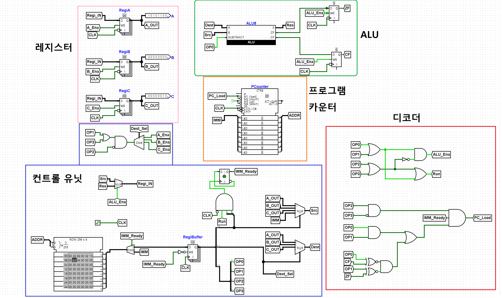
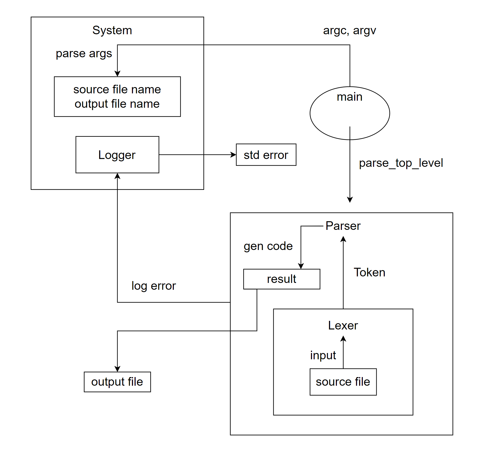

basm
=

### Byung Yoon's 8bit CPU & Assembler

#### cpu 구조


#### 어셈블링 및 실행 영상

<iframe width="560" height="315" src="https://www.youtube.com/embed/pB1YIJpi5VE" title="YouTube video player" frameborder="0" allow="accelerometer; autoplay; clipboard-write; encrypted-media; gyroscope; picture-in-picture; web-share" allowfullscreen></iframe>

#### cpu instruction

- 크기: 8bit
- 구성: 4bit operation code + 2bit dest code + 2bit src code
- 예시: 0010/00/11 : add/regiA/imm (A 레지스터에 imm 값을 더함)

#### operation code table

| operation code | assembly                 | result                                       |
|----------------|--------------------------|----------------------------------------------|
| 0 0 0 0        | **nop**                  | ```no operation```                           |
| 0 0 0 1        | **cmp** *reg*, *reg/imm* | ```dest - source (set flag)```               |
| 0 0 1 0        | **add** *reg*, *reg/imm* | ```dest += source ```                        |
| 0 0 1 1        | **sub** *reg*, *reg/imm* | ```dest -= source ```                        |
| 0 1 0 0        | **ja** *label*           | ```jump if above (zf = 0, cf = 0)```         |
| 0 1 0 1        | **jb** *label*           | ```jump if below (zf = 0, cf = 1)```         |
| 0 1 1 0        | **je** *label*           | ```jump if equal (zf = 1, cf = 0)```         |
| 0 1 1 1        | **jmp** *label*          | ```jump to label (jmp들은 모두 src가 imm이어야 함)``` |
| 1 0 0 0        | **mov** *reg*, *reg/imm* | ```dest <- source```                         |

#### operand code table

구성: dest 2bit + source 2bit

- dest는 imm이 될 수 없음

| operand code | meaning |
|--------------|---------|
| 0 0          | regiA   |
| 0 1          | regiB   |
| 1 0          | regiC   |
| 1 1          | imm     |

CPU 특징:
- A,B,C 세 개의 레지스터를 가지고 있음. 명령어 실행 시 각 레지스터를 자유롭게 dest/src로 사용가능


- ALU에 Zero 와 Carry 플래그가 있어 Comparator 없이 비교 연산 가능. 하지만 Sign 플래그는 없어서 unsigned 비교만 가능함


- 프로그램 카운터에 값을 로드할 수 있어 점프가 가능함. 비교 연산을 함께 사용하면 흐름 제어가 가능함


- 컨트롤 유닛의 경우, D플립플롭으로 상태를 저장해 opcode/operand를 구분되게 읽을 수 있음. 즉 opcode를 읽고 피연산자가 필요하면, 상태를 기억하여 다음에 읽어오는 값은 해석하지 않고 피연산자로 보냄.


- opcode를 command 4bit / dest 2bit / src 2bit 형태로 설계했음. 2진수만 보고도 무슨 명령어인지 쉽게 파악이 가능함.


- 메모리, 시스템 스택, 프로시저 없음.

#### assembly code

```
mov a, 200 ; a <- 200
mov c, 2 ; c <- 2
$l1
sub a, c
cmp a, 0

ja l1
```

a를 200부터 2씩 빼면서 반복하는 코드. 주석은 ; 를 사용하면 됨.   
mov, sub, ja 등 x86 어셈블리와 네이밍이 모두 같음. 대소문자 구분이 없고, 라벨 선언은 $로 표시함. 8bit cpu라서 즉시값은 256 이상이 될 수 없음. 

#### assembler 구조




**System:** 공통 정보 저장 및 유틸성 기능 탑재. 정적 클래스로, 어디서든 접근 가능함. 프로그램 인수 파싱, log error등의 기능이 있음.

**Logger:** 에러가 발생한 토큰의 위치, 토큰의 길이, 에러 메시지를 기입하면 우선순위 큐를 활용해 파일의 위쪽부터 순서대로 표준 오류에 보기 좋게 출력해줌.   
우선순위 큐를 사용하는 이유는 파싱을 할 때 나중에 나온 에러가 더 앞의 에러인 경우가 있기 때문

**Lexer:** 토큰라이저 & 어휘 분석기. 파일로부터 글자를 읽어들여서 이를 저장하고 어떤 토큰인지 반환해줌. 또한, Logger에게 위치 정보등을 제공하는 역할도 함.

**Parser:** Lexer를 내부적으로 가지고 있으며, 토큰을 가져와 코드의 맥락을 읽어 나감. 이를 바탕으로, opcode로 변환해 파일에 쓰는 일까지 함.


#### 추가 영상:

lexer가 읽어오는 토큰을 모두 log_error로 넘겨서 토큰을 제대로 읽어왔는지 확인하는 영상.

<iframe width="560" height="315" src="https://www.youtube.com/embed/VgtUffM4Q6g" title="YouTube video player" frameborder="0" allow="accelerometer; autoplay; clipboard-write; encrypted-media; gyroscope; picture-in-picture; web-share" allowfullscreen></iframe>

parser의 show_code() 기능을 활용해 어셈블링 결과를 확인하는 영상

<iframe width="560" height="315" src="https://www.youtube.com/embed/CsG4fYsjeXQ" title="YouTube video player" frameborder="0" allow="accelerometer; autoplay; clipboard-write; encrypted-media; gyroscope; picture-in-picture; web-share" allowfullscreen></iframe>

문법에 맞지 않는 어셈블리 파일을 어셈블링 했을 때 각 문맥에 맞게 에러 메시지가 제대로 나오는지 확인하는 영상 

<iframe width="560" height="315" src="https://www.youtube.com/embed/7udyaPta5lA" title="YouTube video player" frameborder="0" allow="accelerometer; autoplay; clipboard-write; encrypted-media; gyroscope; picture-in-picture; web-share" allowfullscreen></iframe>

